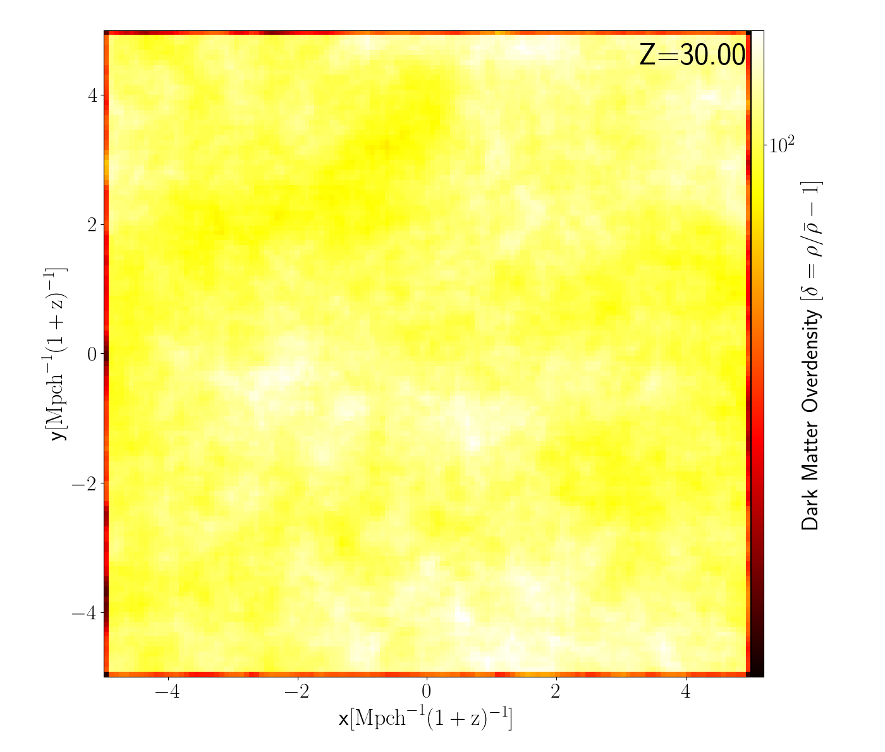
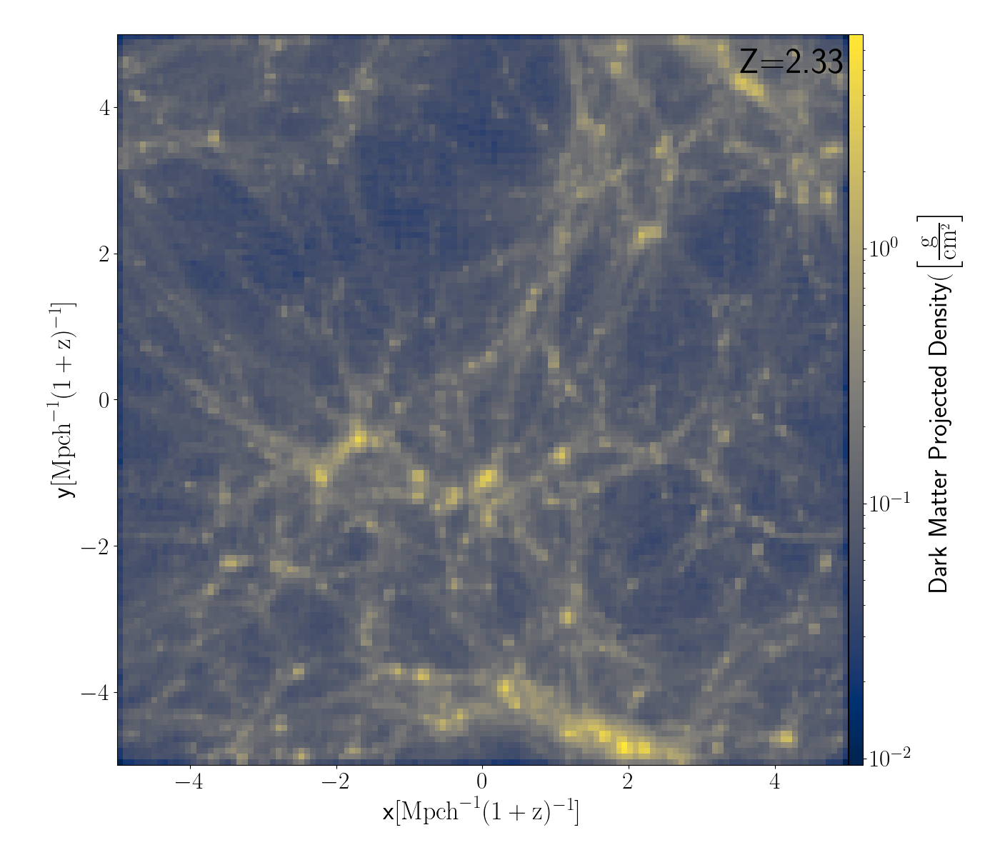
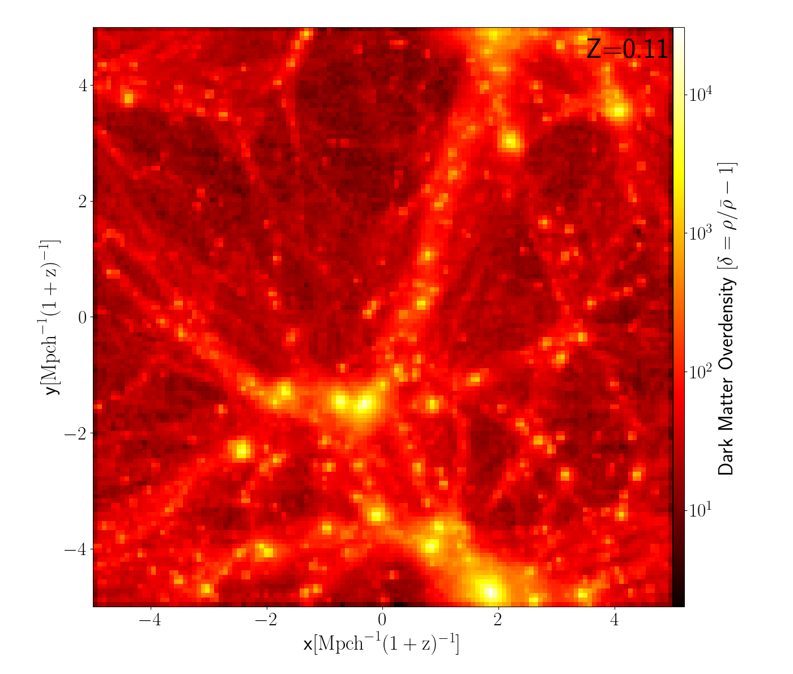

# Black_Hole_ToDoList

## $\color{green} \text{Done} ,\color{orange} \text{In progress}, \\color{Red} \text{Plan to start soon} $

+ $\color{green} \text{Read RAMSES code paper and user manual}$
+ $\color{orange}\text{Read up about Black holes and LCDM cosmology}(z = \infty \to z=6) $
  + $\color{orange}\text{Black hole types and formation scenario}$
  + $\color{green}\text{Matematical details in GR}$
  + $\color{orange}\text{Seeding mechanisms }$
  + $\color{green}\text{Mocking faint black holes during reionization}$
+ $\color{green}\text{Set up cluster account on office desktop, laptop and Remote acees }$
+ $\color{green}\text{Set up code editors and IDE for cluter(VSCode, sshfs) }$
+ $\color{green}\text{Run example simualtions (1Dtube) and analyze data }$
+ $\color{green}\text{Understand details of DM initial conditions relavant for simulation } $
  + $\color{green}\text{Multi-scale initial conditions for cosmological simulations (O. Hahn, T. Abel) } $
  + $\color{green}\text{The properties of cosmic velocity fields (O. Hahn, T. Abel) }$
  + $\color{green}\text{Multiscale Gaussian Random Fields and Their Application to Cosmological Simulations (Edmund Bertschinger) } $
+ $\color{green}\text{Run DM simulations and plot physical quantities }$

<table style="width: 100%;">
  <tr>
    <td style="width: 100%;">
      
    </td>
    <td>
      
    </td>
  </tr>
</table>

<table style="width: 100%;">
  <tr>
    <td style="width: 100%;">
      
    </td>
    <td>
      
    </td>
  </tr>
</table>

<table style="width: 100%;">
  <tr>
    <td style="width: 100%;">
      
    </td>
    <td>
      
    </td>
  </tr>
</table>

<table style="width: 100%;">
  <tr>
    <td style="width: 100%;">
      
    </td>
    <td>
      
    </td>
  </tr>
</table>

<table style="width: 100%;">
  <tr>
    <td style="width: 100%;">
      
    </td>
    <td>
      
    </td>
  </tr>
</table>

<table style="width: 100%;">
  <tr>
    <td style="width: 100%;">
      
    </td>
    <td>
      
    </td>
  </tr>
</table>

+ $\color{green}\text{Run GAS+DM simulations without Cooling and plot physical quantities }$

  
  

&nbsp;&nbsp;&nbsp;&nbsp;&nbsp;&nbsp;&nbsp;&nbsp;&nbsp;&nbsp;&nbsp;&nbsp;&nbsp;&nbsp;&nbsp;&nbsp;&nbsp;&nbsp;&nbsp;&nbsp;&nbsp;&nbsp;&nbsp;&nbsp;&nbsp;&nbsp;&nbsp;&nbsp;&nbsp;&nbsp;&nbsp;&nbsp;&nbsp;&nbsp;&nbsp;&nbsp;&nbsp;&nbsp;&nbsp;&nbsp;  Projected Gas density &nbsp;&nbsp;&nbsp;&nbsp;&nbsp;&nbsp;&nbsp;&nbsp;&nbsp;&nbsp;&nbsp;&nbsp;&nbsp;&nbsp;&nbsp;&nbsp;&nbsp;&nbsp;&nbsp;&nbsp;&nbsp;&nbsp;&nbsp;&nbsp;&nbsp;&nbsp;&nbsp;&nbsp;&nbsp;&nbsp;&nbsp;&nbsp;&nbsp;&nbsp;&nbsp;&nbsp;&nbsp;&nbsp;&nbsp;&nbsp;&nbsp;&nbsp;&nbsp;&nbsp;&nbsp;&nbsp;&nbsp;&nbsp;&nbsp;&nbsp;&nbsp;&nbsp;&nbsp;&nbsp;&nbsp;&nbsp;&nbsp;&nbsp;&nbsp;&nbsp;&nbsp;&nbsp;&nbsp;&nbsp;&nbsp;&nbsp;&nbsp;&nbsp;&nbsp;&nbsp;&nbsp;&nbsp;&nbsp;&nbsp;&nbsp;&nbsp;&nbsp;&nbsp;&nbsp;&nbsp; Projected DM density 

